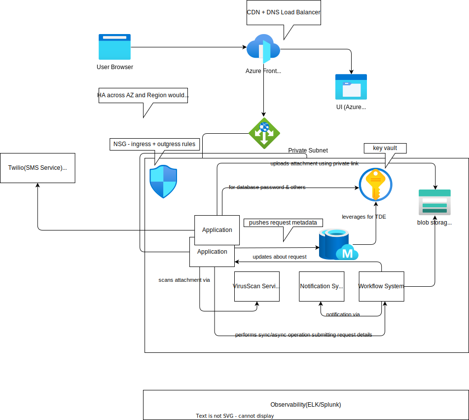

### High Level Estimations

| Metric                        | Calculation                                                                 | Result                  |
|-------------------------------|-----------------------------------------------------------------------------|-------------------------|
| Profile Update Requests       | 10 million requests per day                                                 | ~100 requests/sec       |
| Direct Update Requests        | 20% of total requests                                                       | 20 requests/sec         |
| Approval Requests             | 80% of total requests                                                       | 80 requests/sec         |
| Storage for Attachments       | 8 million requests * 25 MB * 2 uploads                                      | 400,000 GB/day          |
| Storage with Replication      | 400,000 GB/day * replication factor of 3                                     | 1,200,000 GB/day        |
| Request Metadata Storage      | 10 million requests * 1 KB                                                  | 10,000 GB/day           |

### High Level Profile Update Flow


### High Level Diagram/Components


### System Setup and Configuration

#### UI Hosting:
- Leveraging Static Web Hosting capability of Azure.
- All images, CSS, HTML, etc., are served from Azure.

#### High Availability Web Application:
- Built to handle incoming requests from the API Gateway.

#### Network Configuration:
- Setup is configured in a private subnet.
- NSG (Network Security Group) rules are configured for ingress and egress traffic.

#### Application Server:
- Receives and sanitizes and validates incoming requests.
- Scans attached documents via a scan service.
- Pushes request data to the database and blob storage.

#### Multi-Factor Authentication (MFA):
- Utilizes Twilio to send SMS PINs for an extra layer of authentication.

#### Workflow System:
- Leverages a home-grown/BPMN-based workflow system.
- Supports synchronous and asynchronous operations.
- Sends notifications upon completion of operations.

### Handling request
- UI submits the request for modification to the origin server.
- Origin server needs to block the request so that it can accept request change, attachment.
- Application Server sanitizes the request and leverages virus scan service to scan the attachment before persisting the details (metadata + attachment) to db & blob storage.
- Application redirects for MFA (such as email OTP) along with request id generated out of metadata + attachment.
- On successful validation of OTP, server submits the request to workflow engine for sync and async processing of request.
- Workflow system can process the request sync/async manner depending upon type of request.
- Finally, server returns the request ID, along with other status.

### Assumptions
- Services like Virus Scan, Workflow System, Notification System is already developed services, so I am not considering estimation for same.
- Obviously, we have to consider the expected load which they can handle, we need to know in advance their p95 response time, etc.


#### Metadata Schema Definition

##### REQUEST_UPDATE Table

| Column Name       | Data Type         | Description                                      |
|-------------------|-------------------|--------------------------------------------------|
| ID                | VARCHAR2(100)     | PRIMARY_KEY                                      |
| FOR_USER          | VARCHAR2(100)     | SECONDARY INDEX                                  |
| REQUEST_BODY      | BLOB              |                                                  |
| STATUS            | VARCHAR2(100)     | ACCEPTED, INPROGRESS, COMPLETED, REJECTED, WAITING_FOR_INFO, etc |
| LAST_UPD_USR      | VARCHAR2(100)     |                                                  |
| LAST_UPD_TSTMP    | TIMESTAMP         |                                                  |

##### REQUEST_UPDATE_ATTACHMENT Table

| Column Name           | Data Type         | Description                                      |
|-----------------------|-------------------|--------------------------------------------------|
| ID                    | VARCHAR2(100)     | PRIMARY_KEY                                      |
| REQUEST_UPDATE_ID     | VARCHAR2(100)     | FOREIGN_KEY (REFERENCES REQUEST_UPDATE table)    |
| DOC_LOCATION          | VARCHAR2(100)     |                                                  |
| SUPPORTING_ATTRIBUTE  | VARCHAR2(100)     | For which attribute document is uploaded (e.g., name, address, etc) |
| LAST_UPD_USR          | VARCHAR2(100)     |                                                  |
| LAST_UPD_TSTMP        | TIMESTAMP         |                                                  |


#### Blob storage
- For each user request, we will create container(Azure blob container).
- Within the container we will be creating folder to represent request id.
- Under this folder, all the attachments will be uploaded.


#### API Definition(supports chunking)

| Field           | Value                                                                                       |
|-----------------|---------------------------------------------------------------------------------------------|
| **API URI**     | `PATCH /profilemanagement/v1/profiles/internalID`                                                          |
| **Request Header** | `Content-Type: multipart/form-data`                                                      |
| **Request Body**   |                                                                                          |
|                 | `--boundary`                                                                                |
|                 | `Content-Disposition: form-data; name="json"`                                               |
|                 |                                                                                             |
|                 | `{`                                                                                         |
|                 | `  "lastName": "Doe",`                                                                      |
|                 | `  "maritalStatus": "Single",`                                                              |
|                 | `}`                                                                                         |
|                 | `--boundary`                                                                                |
|                 | `Content-Disposition: form-data; name="lastName-Attachment1"; filename="document1.pdf"`              |
|                 | `Content-Type: application/pdf`                                                             |
|                 |                                                                                             |
|                 | `<binary data>`                                                                             |
|                 | `--boundary`                                                                                |
|                 | `Content-Disposition: form-data; name="maritalStatus-attachment2"; filename="image1.png"`                 |
|                 | `Content-Type: image/png`                                                                   |
|                 |                                                                                             |
|                 | `<binary data>`                                                                             |
|                 | `--boundary--`                                                                              |

##### API Response

| Status Code                  | Description                        | Response Header                                                                 | Response Body                                                                 |
|------------------------------|------------------------------------|-------------------------------------------------------------------------------|-------------------------------------------------------------------------------|
| 200 OK                       | Synchronous Operation              |                                                                               |                                                                               |
| 202 Accepted                 | Asynchronous Operation             | HTTP/1.1 202 Accepted                                                         |                                                                               |
|                              |                                    | Location: /profilemanagement/v1/requests/requestID                            |                                                                               |
| 400 Bad Request              | Client Validation Error            |                                                                               | {                                                                             |
|                              |                                    |                                                                               |   "error": {                                                                  |
|                              |                                    |                                                                               |     "code": "0977658587",                                                     |
|                              |                                    |                                                                               |     "message": "validation error"                                             |
|                              |                                    |                                                                               |   }                                                                           |
|                              |                                    |                                                                               | }                                                                             |
| 401 Unauthorized             | Client Authentication Error        |                                                                               | {                                                                             |
|                              |                                    |                                                                               |   "error": {                                                                  |
|                              |                                    |                                                                               |     "code": "0977658581",                                                     |
|                              |                                    |                                                                               |     "message": "User not authenticated"                                       |
|                              |                                    |                                                                               |   }                                                                           |
|                              |                                    |                                                                               | }                                                                             |
| 403 Forbidden                | Client Authorization Error         |                                                                               | {                                                                             |
|                              |                                    |                                                                               |   "error": {                                                                  |
|                              |                                    |                                                                               |     "code": "0977658580",                                                     |
|                              |                                    |                                                                               |     "message": "User not permitted to perform this operation"                 |
|                              |                                    |                                                                               |   }                                                                           |
|                              |                                    |                                                                               | }                                                                             |
| 500 Internal Server Error    | Server Side Error                  |                                                                               | {                                                                             |
|                              |                                    |                                                                               |   "error": {                                                                  |
|                              |                                    |                                                                               |     "code": "0977658579",                                                     |
|                              |                                    |                                                                               |     "message": "Issue occurred during operation."                             |
|                              |                                    |                                                                               |   }                                                                           |
|                              |                                    |                                                                               | }                                                                             |
| ...                          | ...                                | ...                                                                           | ...                                                                           |
##### API Idempotence
API is idempotent.

### Low Level Details

#### How do we identify if the request qualifies for sync or async operation?
- This is done by the workflow system which is already designed. At a high level, we just submit the `List<ChangedAttribute>` to the workflow in the following VO form:

  ```java
  class ChangedAttribute {
     private String attributeName;
     private String newAttributeValue;
     private List<String> supportingDocumentationLocations;
  }


- The workflow system has a list of rules which is configured to determine if a certain attribute change qualifies for an async operation.
- The workflow system has its own underlying architecture to handle requests, which I am limiting to an abstract level for this use case. The workflow system is configured with Aadhar system callback URI to send the response back in case of an async operation.
- Aadhar system callback URI updates the request status given the requestID and update profile data in DB eventually sends a notification to the user.
- For fallback mechanism, Aadhar system has background job to keep updating the request status & updates profile data by polling the workflow system.

#### How system is taking care of authorization aspect?
- The system has home grown RBAC roles and permissions. By default it allows the profile owner and admin with specific role + permission to allow the update.
- The java service layer takes care of authorization.

### Handling Requests as per Normal Condition

#### Total time per request

| Task                          | Details                                                                                       | Time Taken      |
|-------------------------------|-----------------------------------------------------------------------------------------------|-----------------|
| **At 1 Gbps Attachment Upload** |                                                                                             |                 |
| - Azure vm upload speed         | Typically between 1 Gbps to 10 Gbps, considering 1 Gbps speed (1000 Mbps)                     |                 |
| - 25 MB file                  | 25 MB * 8 = 200 Mb (megabits)                                                                 |                 |
| - Upload time                 | 200 Mb / 1000 Mbps = 0.2 sec                                                                  | 0.2 sec         |
| - Average 2 uploads per request | Total time for 2 uploads: 0.2 sec * 2 = 0.4 sec                                             | 0.4 sec         |
| **Metadata request update**   | Should be in milliseconds                                                                     | 100 ms          |
| **Sanitization of request**   | Should be in milliseconds                                                                     | 100 ms          |
| **Total time taken to handle a request with upload** | Sum of all tasks: 0.4 sec (uploads) + 100 ms (metadata) + 100 ms (sanitization) | ~1 sec          |

#### Minimum number of servers needed

Since its I/O bound request, as a rule we should consider 4:1 rule i.e 4 concurrent requests per core.
Again, it would vary based on other existing functionality being offered. From the below table I am choosing 8 cores which results in 3 servers. So, in normal circumstances as per the calculation 3 + 2 = 5 servers is good enough.

| CPU Cores per Server | Concurrent requests per Core   | Number of Servers Needed( ~= 80 requests/Concurrent requests per Core) |
|----------------------|--------------------------------|--------------------------|
| 16                   | 64                             | 2                        |
| 8                    | 32                             | 3                        |
| 4                    | 16                             | 5                        | 
| 2                    | 8                              | 10                       | 

#### Minimum number of Connections required per server(Connection Pool)

Based on above table, if we take 8 cores then we can concurrently handle 32 requests. So, DB connection of 32 must be required to handle incoming requests.
But DB operation wont take much time to perform the operation. So, we can keep 50 max connections as of now, rest of the figure will be cleared when we perform actual load testing using tools like JMeter.

#### How do we deploy?
- Code is written in a JEE complaint server(or any other language) with 50 http threads configured (32 + some buffer for 8 core CPU selected above)
- We can leverage Kubernetes for the deployment.


### High Scale Requirement of peak load(assuming 80 * 10 - 800 concurrent requests)
- We can consider auto scaling offered by K8s.
- With 3 servers we are able to 80 requests then we would required atleast 25 servers to handle 800 concurrent requests.

### Addressing Security Requirement
- Data at rest must be secured - we can leverage DB' TDE(Transparent Data Encryption) for same. OOTB Blob storage offers encryption using AES 256.
- Data in transit must be secured - We must leverage minimum TLS 1.2 for communication.
- The system should not let bad data to get into system - for this we must sanitize the request, leverage virusscan service, leverage OWASP libraries to sanitize the request.
- Allow only authenticated user to perform the operation - for this we are leveraging MFA of asking SMS pin.
- Allow only authorized user to perform the operation - the system has home grown RBAC rules to address same.
- Database secrets, etc must be stored in Vault.
- The audit aspect must be maintained.


### Purging Requirement
- The data can be purged or archived by moving the data into cold storage.
- The DB table can be further partitioned based on month or year.

### Observability
- System is addressing the observability usecases by having proper logging mechanism and central log repository and alerting rules.

### Quality Aspects
- System must cover unit testcases and integration testcases. They should be automated as much as possible.
- Branching strategy must be clearly defined, proper CI - CD pipeline must be setup for faster delivery.

### High Availability Aspects
- We can keep the system replicated in two or more availability zone, only one will be active at time, others will be in stand-by mode.
- The DB can be synced in async manner.
- The blob storage is ZRS enabled, if required we can enable Geo-ZRS as well.
- If the situation demands we can also deploy the instance more than one region considering data sovereignty aspects.
