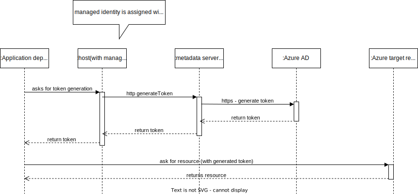

### About System Managed Identity Based Authentication & Authorization

This is the most standard way of allowing(authenticating and authorizing) one resource in Azure to access another resource. For instance, if Azure VM or Azure Function wants to access Azure Blob Storage then System managed identity assignment on the caller with required Roles(and permission for the target resource) is the way to go.

### Process Explained Using Two Step Process

### Step 1 Assignment of Role+Permission to Managed Identity 

### Step 2 Access actual resource Process

