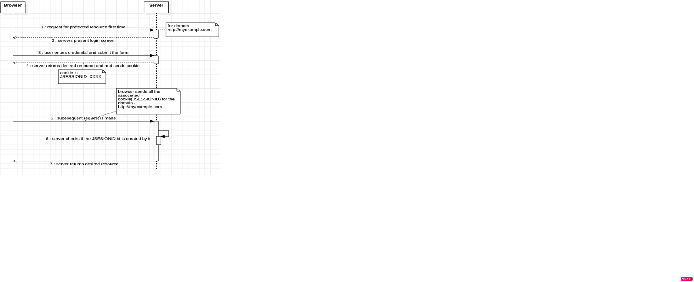
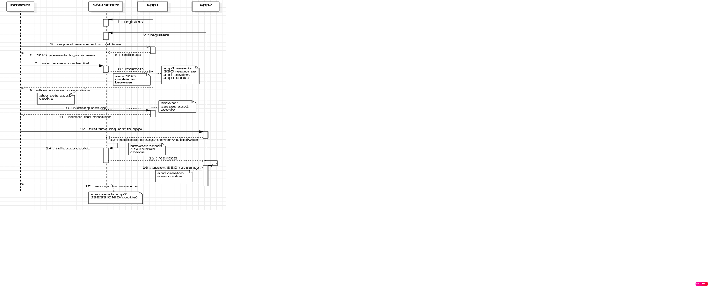
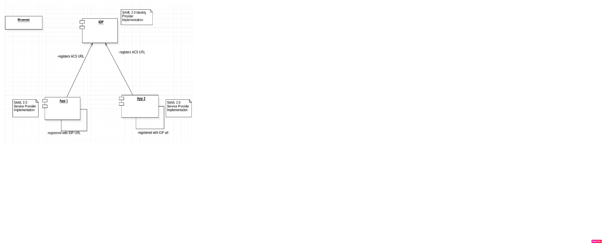
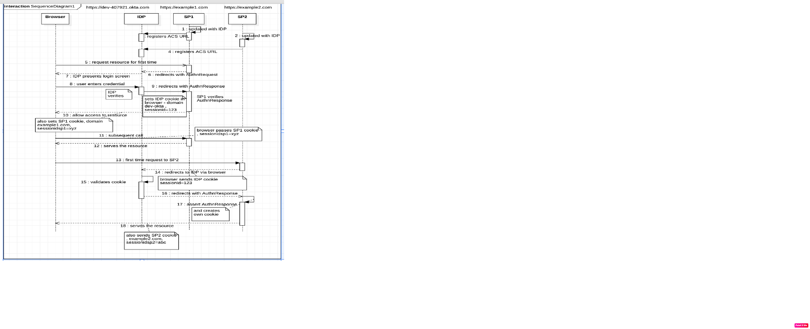

### About Single Sign On(SSO)
SSO allows one or more applications to honour the authentication done by first application. The main crux of this is cookie mechanism, we wil deep dive into this to find out how it works in simple understandable format.

### How a simple sign-in mechanism works?

### How a simple sso mechanism across multiple application works?

### SAML as standardization for SSO

### SAML flow

