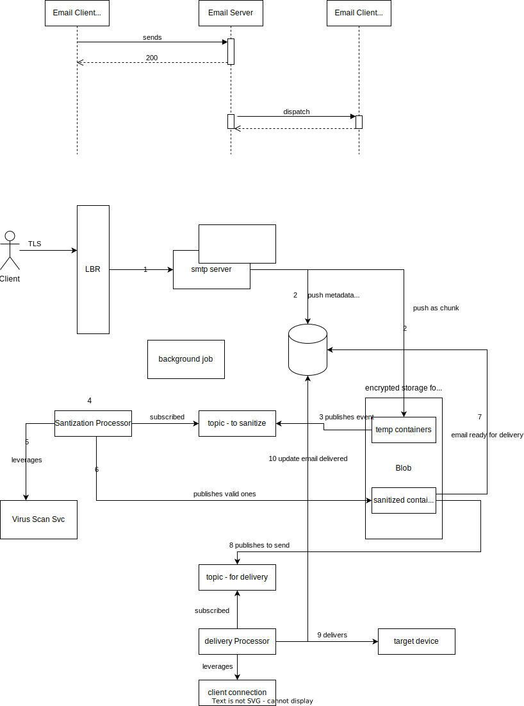

### About the requirement
- Design an email receiving server which accepts incoming emails to its domain and relays them to its users.
- For simplicity, assume 1 device per user with attachment and message size in MB.
- Must guarantee at least once delivery.
- Assume 5 million users for that specific domain.
- Assume 2 million active users.
- 2 million active users receive 10 emails per day each.
- Approximately 5000 emails per second.
- Expected email delivery latency is approximately 2 seconds.

### Incorporating the requirement
